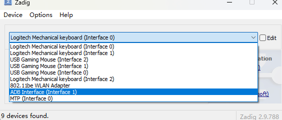
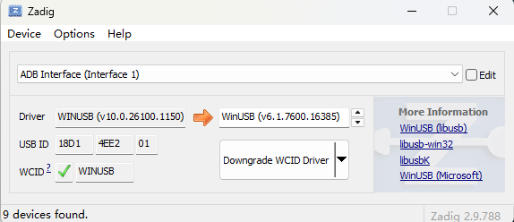

# 雷鸟 X3 Pro Agent App 安装说明

本文记录 2026-09-01 上午完成的雷鸟 X3 Pro Agent App 安装流程，供现场测试、重复安装和故障排查使用。

## 1. 安装对象

| 项目 | 当前值 |
|---|---|
| App 名称 | 雷鸟 Agent A |
| 用途 | 雷鸟 X3 Pro 发起方 Agent A 联调 |
| 应用 ID | `com.rayneo.agent.example.rayneo` |
| 启动 Activity | `com.rayneo.agent.example.RayNeoMainActivity` |
| 当前版本 | `0.2.6-rayneo`，`versionCode=8` |
| APK | `android/example-app/build/outputs/apk/rayneo/debug/example-app-rayneo-debug.apk` |
| 当前 APK SHA-256 | `6337f24acbe96d2c6558e148d164de30bd51d46bf4793f9bcff7e6c0bce82452` |

该专用包固定为发起方 A，预置以下联调参数：

| 参数 | 值 |
|---|---|
| AgentRuntime | `101.245.78.174:8088/TCP` |
| MASQUE | `101.245.78.174:8443/UDP` |
| MASQUE 路径 | `/.well-known/masque/ip` |
| 本地 A2A TCP/UDP | `4001/28443` |
| DNN | `internet` |
| Agent 名称 | `RayNeo-X3-Pro-A` |
| 发现能力 | `text` |

APK 是封闭联调 Debug 构建，包含测试能力 VC 签发材料并关闭部分生产安全校验，不得作为生产发布包使用。

## 2. 安装前准备

准备以下环境：

- Windows 10/11 电脑。
- 可传输数据的 USB 线；只支持充电的线无法使用 ADB。
- 雷鸟 X3 Pro 已开启开发者模式和 USB 调试。
- Android Platform Tools，建议放在 `C:\Android\platform-tools`。
- PowerShell 5.1 或更高版本。
- 已构建的 RayNeo APK，或可以构建本仓库 Android 工程的环境。
- 电脑和眼镜所在网络可以访问 `101.245.78.174:8088/TCP` 和 `101.245.78.174:8443/UDP`。

默认安装脚本位于：

```text
android/install-rayneo-windows.ps1
```

## 3. 连接眼镜并确认 ADB

1. 使用 USB 数据线连接眼镜与 Windows 电脑。
2. 在眼镜中开启开发者模式和 USB 调试。
3. 打开 PowerShell，执行：

```powershell
C:\Android\platform-tools\adb.exe kill-server
C:\Android\platform-tools\adb.exe start-server
C:\Android\platform-tools\adb.exe devices -l
```

首次连接时，眼镜可能显示“允许 USB 调试”提示。确认电脑指纹并允许后，再次执行 `adb devices -l`。

正常结果应包含一台状态为 `device` 的设备，例如：

```text
BC942406217E342    device product:RayNeoX3Pro model:ARGF20 device:MercuryLiteXR
```

状态含义：

| 输出 | 处理方法 |
|---|---|
| `device` | ADB 已连接，可以安装 |
| `unauthorized` | 在眼镜中确认 USB 调试授权，然后重新执行命令 |
| `offline` | 重插 USB 线并重启 ADB Server |
| 没有设备 | 检查数据线、USB 调试和 Windows 驱动，必要时执行下一节 |

安装脚本要求恰好有一台已授权且状态为 `device` 的 ADB 设备。多台设备同时连接时，应断开无关设备后再执行脚本。

## 4. Windows 无法识别 ADB 时安装 WinUSB 驱动

如果 `adb devices -l` 没有列出眼镜，但 Windows 能检测到 USB 设备，可以使用 Zadig 修复 ADB 接口驱动。ADB 已正常识别时不要执行本节。

1. 以管理员身份运行 Zadig。
2. 打开 `Options`，启用 `List All Devices`。
3. 从设备列表中选择 `ADB Interface (Interface 1)`。
4. 核对 USB ID 为 `18D1:4EE2`，接口号为 `01`。
5. 目标驱动选择 `WinUSB`，执行 `Install Driver`、`Replace Driver` 或界面显示的对应 WinUSB 操作。
6. 完成后重新插拔眼镜，并再次执行 `adb kill-server`、`adb start-server` 和 `adb devices -l`。

必须选择 `ADB Interface (Interface 1)`，不要误选 `MTP (Interface 0)`、键盘、鼠标、无线网卡或其他 USB 设备。



确认设备为 `ADB Interface (Interface 1)`、USB ID 为 `18D1:4EE2` 后，将该接口驱动设置为 WinUSB：



## 5. 推荐安装方式：PowerShell 脚本

进入仓库的 `android` 目录：

```powershell
cd <SDK仓库目录>\android
```

### 5.1 正常安装

推荐真实用户和正式测试使用系统 VPN 授权流程：

```powershell
powershell -ExecutionPolicy Bypass -File .\install-rayneo-windows.ps1
```

脚本会依次执行：

1. 检查 `adb.exe` 和 APK 是否存在。
2. 确认只有一台已授权 ADB 设备。
3. 使用 `adb install -r` 安装或覆盖升级 APK。
4. 停止旧 App 进程。
5. 启动雷鸟 Agent A。

App 启动后，用镜腿单击“启用 Agent 网络”。首次运行会出现 Android 系统“网络连接请求”，必须在眼镜中确认一次。

### 5.2 指定 ADB 和 APK 路径

如果文件不在默认位置：

```powershell
powershell -ExecutionPolicy Bypass -File .\install-rayneo-windows.ps1 `
  -AdbPath "D:\platform-tools\adb.exe" `
  -ApkPath "D:\packages\example-app-rayneo-debug.apk"
```

### 5.3 内部联调时预授权 VPN

仅内部联调或受管设备可以使用：

```powershell
powershell -ExecutionPolicy Bypass -File .\install-rayneo-windows.ps1 -PreAuthorizeVpn
```

该参数通过 ADB 执行：

```powershell
adb shell appops set com.rayneo.agent.example.rayneo ACTIVATE_VPN allow
```

预授权只省略系统 VPN 确认页。App 启动后仍需单击“启用 Agent 网络”才会建立 TUN、MASQUE 和 Agent 流程。正式部署不得依赖 ADB 预授权绕过用户首次同意。

## 6. 手工安装与启动

不使用脚本时，可以直接执行：

```powershell
$Adb = "C:\Android\platform-tools\adb.exe"
$Apk = "<SDK仓库目录>\android\example-app\build\outputs\apk\rayneo\debug\example-app-rayneo-debug.apk"

& $Adb install -r $Apk
& $Adb shell am force-stop com.rayneo.agent.example.rayneo
& $Adb shell am start -n "com.rayneo.agent.example.rayneo/com.rayneo.agent.example.RayNeoMainActivity"
```

如果服务器临时要求 MASQUE Token，可在启动时传入；Token 只保留在当前进程内：

```powershell
& $Adb shell am force-stop com.rayneo.agent.example.rayneo
& $Adb shell am start `
  -n "com.rayneo.agent.example.rayneo/com.rayneo.agent.example.RayNeoMainActivity" `
  --es masque_token "<TOKEN>"
```

## 7. 眼镜端首次使用

1. 从眼镜 Launcher 打开“雷鸟 Agent A”；安装脚本通常会自动启动。
2. 确认页面显示固定部署信息：Runtime `101.245.78.174:8088`、MASQUE/UDP `8443`。
3. 单击“启用 Agent 网络”。
4. 首次运行时，在 Android 系统页面确认“网络连接请求”。
5. 等待页面依次显示 VPN、TUN、MASQUE、身份申请、网络能力、Agent Card、发现、建组和群组配置结果。
6. 群组配置完成后，主要操作变为“发送测试消息”；单击即可向 Agent B 发送带序号的预置消息。

镜腿操作：

| 操作 | 行为 |
|---|---|
| 前后滑或上下滑 | 在“主要操作 / 重置 / 停止”之间切换焦点 |
| 单击 | 执行当前焦点操作 |
| Reset 连续确认两次 | 仅清除本地身份状态并回到状态1，不向网侧发送去注册消息 |
| 双击 | 停止流程、释放 SDK/VPN 资源并退出 |

VPN 授权通常在关闭 App、重启眼镜和同包名 `install -r` 升级后继续保留。卸载 App、清除应用数据、用户撤销权限或允许另一个 VPN App 后，需要重新授权。

## 8. 安装结果验证

查看安装路径：

```powershell
C:\Android\platform-tools\adb.exe shell pm path com.rayneo.agent.example.rayneo
```

查看版本：

```powershell
C:\Android\platform-tools\adb.exe shell dumpsys package com.rayneo.agent.example.rayneo |
  findstr /I "versionCode versionName"
```

当前版本应包含：

```text
versionCode=8
versionName=0.2.6-rayneo
```

检查 VPN AppOps：

```powershell
C:\Android\platform-tools\adb.exe shell appops get `
  com.rayneo.agent.example.rayneo ACTIVATE_VPN
```

检查 App 进程：

```powershell
C:\Android\platform-tools\adb.exe shell pidof com.rayneo.agent.example.rayneo
```

## 9. 覆盖升级、停止和卸载

覆盖升级并保留应用数据：

```powershell
C:\Android\platform-tools\adb.exe install -r <APK路径>
```

停止 App：

```powershell
C:\Android\platform-tools\adb.exe shell am force-stop com.rayneo.agent.example.rayneo
```

卸载 App：

```powershell
C:\Android\platform-tools\adb.exe uninstall com.rayneo.agent.example.rayneo
```

卸载会删除 App 私有数据、SDK 本地身份状态、密钥和 VPN 授权。需要保留这些数据时不要卸载，使用 `install -r` 覆盖升级。

## 10. 常见问题

### 10.1 脚本提示 `adb.exe not found`

确认 Platform Tools 已安装，或通过 `-AdbPath` 指定真实路径。

### 10.2 脚本提示 `RayNeo APK not found`

通过 `-ApkPath` 指定 APK，或先按第 11 节构建。

### 10.3 脚本提示只允许一台设备

执行 `adb devices -l`，断开其他 Android 设备或模拟器，只保留一台状态为 `device` 的雷鸟眼镜。

### 10.4 `adb devices` 为空、`offline` 或 `unauthorized`

- `unauthorized`：在眼镜中确认 USB 调试指纹。
- `offline`：重插 USB 线并重启 ADB Server。
- 空列表：检查数据线和 USB 调试；Windows 驱动异常时按第 4 节处理。

### 10.5 安装后找不到 App

确认安装的是 `rayneo` APK，而不是 `generic` APK。RayNeo 包的 Manifest 包含 `com.rayneo.mercury.app=true`，应用名为“雷鸟 Agent A”。也可以使用第 6 节命令直接启动。

### 10.6 单击后没有连接或连接失败

依次检查：

- 首次 VPN 授权是否已经确认。
- `101.245.78.174:8088/TCP` 是否可达。
- `101.245.78.174:8443/UDP` 是否被防火墙或网络策略阻断。
- AgentRuntime、MASQUE Server 和对端 Agent B 是否已经启动。
- 服务端要求 Token 时，是否通过 `masque_token` 启动参数传入。

失败时 App 会停留在当前步骤。将焦点切换到主要操作并单击，可重试当前流程；不需要反复卸载。

### 10.7 VPN 授权页覆盖眼镜界面

当前 App 不会在启动时自动弹出授权页，必须先单击“启用 Agent 网络”。如果授权页已经出现，完成确认或返回 App；不要通过反复启动 App 叠加系统页面。

## 11. 重新构建 RayNeo APK

Linux/WSL 构建：

```bash
cd <SDK仓库目录>/android
ANDROID_HOME=/opt/android-sdk \
ANDROID_SDK_ROOT=/opt/android-sdk \
./gradlew clean :example-app:assembleRayneoDebug
```

Windows 构建：

```powershell
cd <SDK仓库目录>\android
.\gradlew.bat clean :example-app:assembleRayneoDebug
```

构建产物：

```text
android/example-app/build/outputs/apk/rayneo/debug/example-app-rayneo-debug.apk
```

每次重新构建后都应重新计算 SHA-256，不要继续使用本文第 1 节的旧摘要：

```powershell
Get-FileHash `
  .\example-app\build\outputs\apk\rayneo\debug\example-app-rayneo-debug.apk `
  -Algorithm SHA256
```

## 12. 相关文件

- 安装脚本：`android/install-rayneo-windows.ps1`
- Android/RayNeoOS 总体说明：`android/README.md`
- RayNeo Manifest：`android/example-app/src/rayneo/AndroidManifest.xml`
- RayNeo 入口：`android/example-app/src/rayneo/kotlin/com/rayneo/agent/example/RayNeoMainActivity.kt`
- 固定部署参数：`android/example-app/src/main/kotlin/com/rayneo/agent/example/TestConfig.kt`
